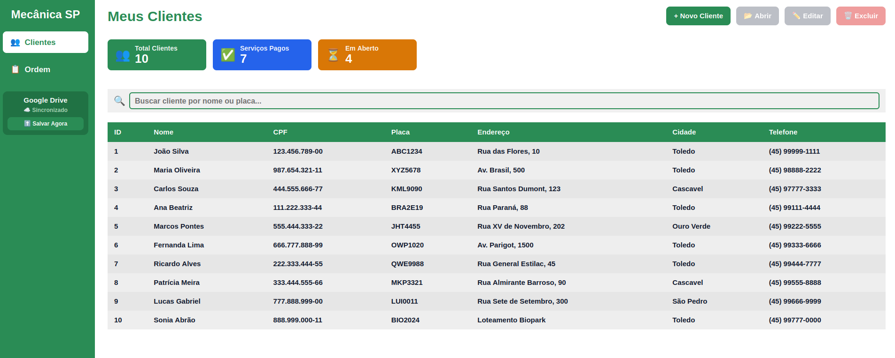
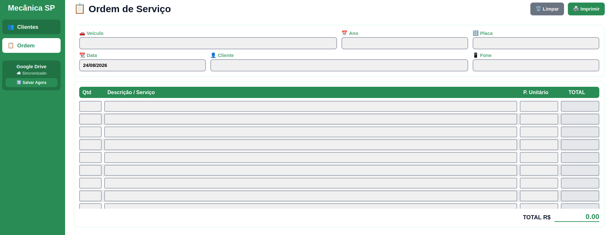

# Oficina Pro

**Sistema de gerenciamento para oficinas mecânicas**

  <em>Projeto privado — este repositório é uma vitrine (case study) do produto. 
  O código-fonte não está disponível publicamente.</em>

---

## Demonstração

  
  
<em>Listagem e cadastro de clientes — com máscaras de CPF e telefone</em>

 

  
  
<em>Ordem de serviço — controle de status e pagamento</em>

---

## Sobre o projeto

O **Oficina Pro** é um sistema desktop para gerenciamento de clientes, serviços e ordens de serviço em oficinas mecânicas. Desenvolvido com Python e interface gráfica moderna via CustomTkinter, conta com backup automático no Google Drive.

O objetivo do produto é resolver um problema comum de pequenas oficinas: organizar clientes, veículos e ordens de serviço sem depender de papel, planilhas soltas ou sistemas caros e complicados.

---

## Principais funcionalidades

- **Cadastro de clientes** com máscara de CPF e telefone
- **Ordens de serviço** com controle de status e pagamento
- **Relatório em HTML** pronto para impressão
- **Backup automático** no Google Drive via OAuth2
- **Interface moderna** com tema verde personalizado
- **Executável standalone** — não exige instalação de Python no computador do cliente

---

## Stack técnica

| Camada | Tecnologia |
|---|---|
| Linguagem | Python 3.10+ |
| Interface gráfica | CustomTkinter |
| Banco de dados | SQLite |
| Backup em nuvem | Google Drive API (OAuth2) |
| Build / distribuição | PyInstaller |

---

## Sobre este repositório

Este é um repositório **de demonstração**, criado para fins de portfólio. Ele não contém o código-fonte da aplicação — apenas a descrição do produto, prints e a stack utilizada.

Se você tiver interesse em conhecer mais detalhes técnicos ou ver uma demonstração ao vivo, entre em contato:

📧 jhonatanmargraf@gmail.com

---

  Desenvolvido por Jhonatan Margraf

